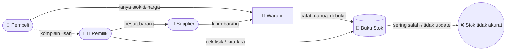
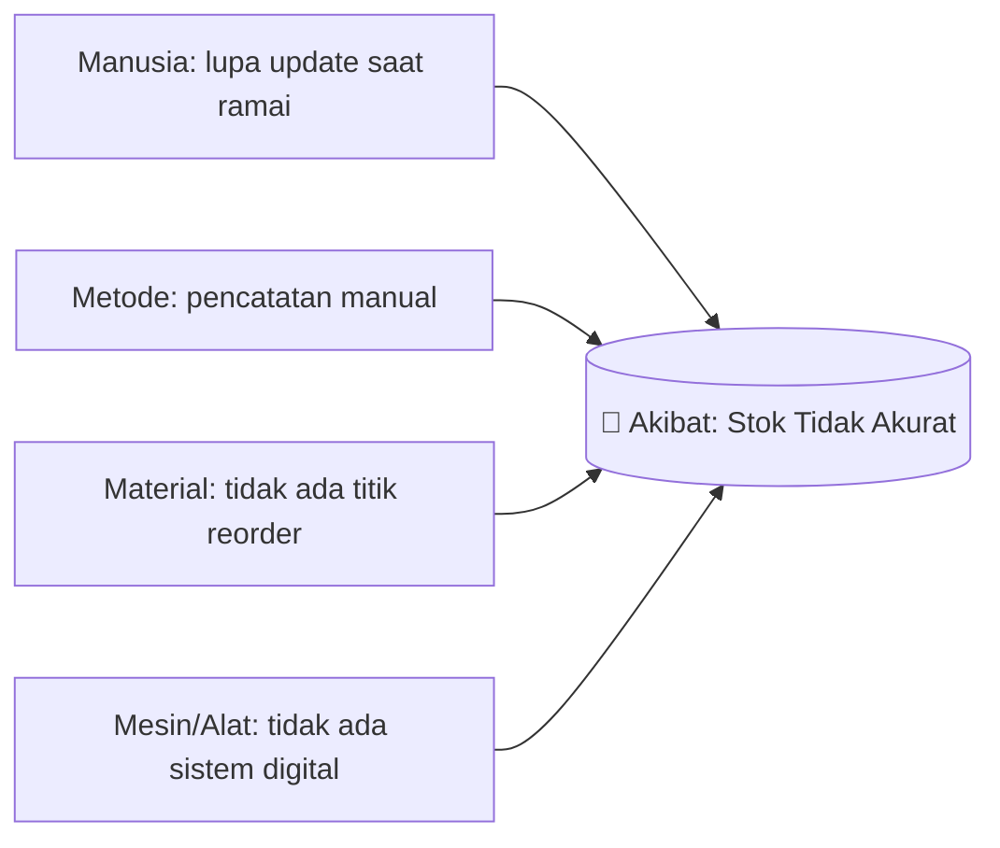
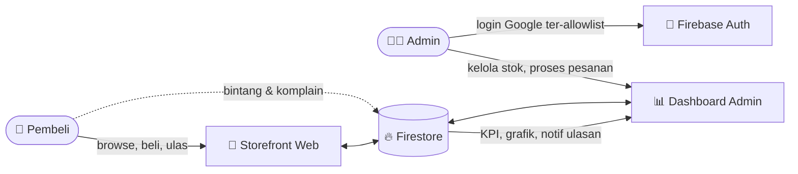

# 2. Tahap Analisis Sistem

## 2.a. Sistem Berjalan (Rich Picture — kondisi manual)

**Masalah pada sistem berjalan:** pencatatan manual, stok tidak real-time, keputusan
restock berbasis perkiraan, dan komplain pelanggan tidak terekam.

## 2.b. Analisis SWOT, PIECES, Fishbone

### SWOT
| Internal | |
|----------|---|
| **Strengths** | Murah (Firebase gratis), real-time, mudah diakses web, ada analitik & ulasan |
| **Weaknesses** | Butuh internet, pembayaran masih dummy, bergantung pada layanan Google |
| **External** | |
| **Opportunities** | Digitalisasi UMKM sedang didorong; bisa diperluas ke pembayaran nyata & multi-cabang |
| **Threats** | Kompetitor aplikasi kasir; ketergantungan kuota internet; keamanan data |

### PIECES
| Aspek | Sistem Lama (Manual) | Sistem Baru (Warung Analytics) |
|-------|----------------------|-------------------------------|
| **P**erformance | Lambat, cek fisik | Stok real-time via Firestore |
| **I**nformation | Tidak akurat, tak ada laporan | KPI, grafik, status stok otomatis |
| **E**conomy | Boros (salah pesan) | Restock berbasis data & titik reorder |
| **C**ontrol | Lemah, siapa saja bisa ubah | Login admin + Firestore Rules |
| **E**fficiency | Catat ganda manual | Input sekali, dipakai semua laporan |
| **S**ervice | Komplain lisan hilang | Kanal ulasan & komplain terekam |

### Fishbone (Ishikawa) — Sebab "Stok Tidak Akurat"

## 2.c. Kebutuhan Sistem Baru (Rich Picture — usulan)

### Kebutuhan Fungsional
- Pembeli: lihat katalog, atur jumlah, keranjang, checkout (dummy), beri ulasan/komplain.
- Admin: kelola stok (+/−, tambah 1000, hapus), proses pesanan (kurangi stok), lihat KPI &
  grafik, terima notifikasi ulasan/komplain.

### Kebutuhan Non-Fungsional
- **Keamanan:** hanya email admin yang bisa menulis data (Firestore Rules).
- **Usability:** responsif, dukung tema gelap/terang, multi-bahasa (ID/EN).
- **Performa:** data real-time, pagination untuk katalog besar.
