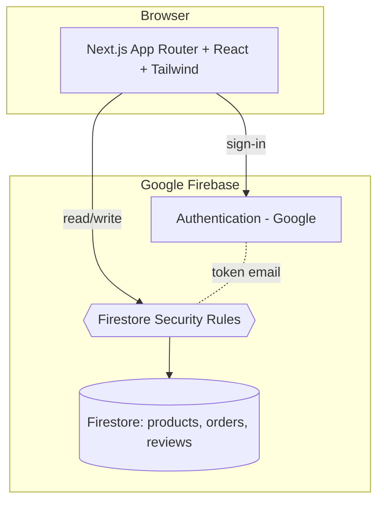
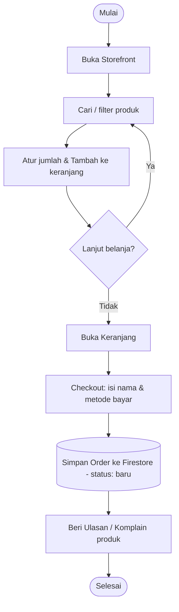
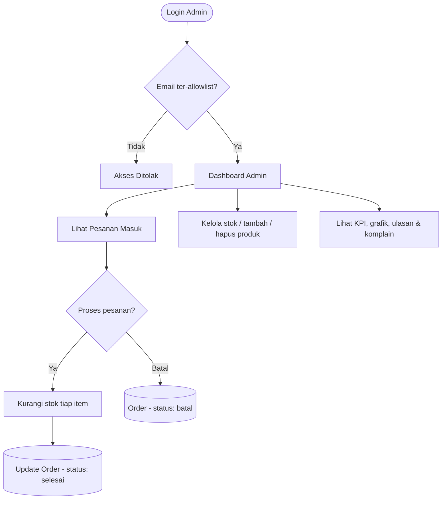
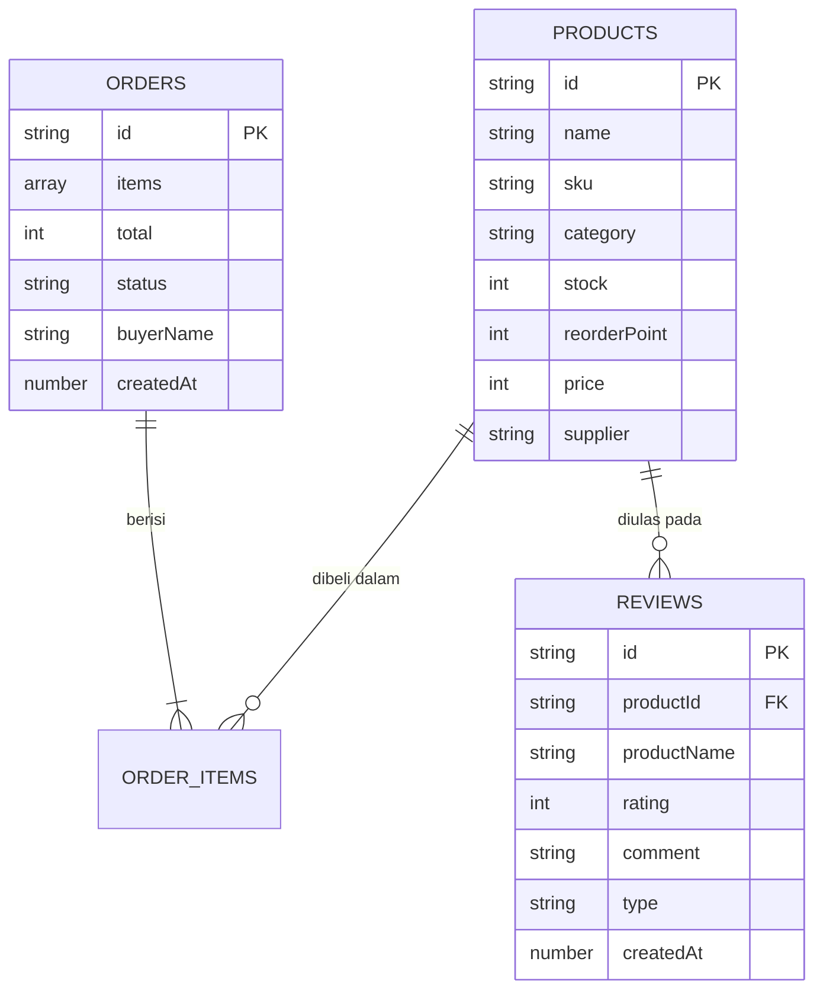

# 3. Tahap Perancangan Sistem

## 3.a. Rancangan & Spesifikasi Teknis

### Arsitektur

### Spesifikasi Teknis
| Komponen | Teknologi |
|----------|-----------|
| Frontend | Next.js 14, React 18, TypeScript, Tailwind CSS, Framer Motion |
| Backend / DB | Firebase Firestore (NoSQL, real-time) |
| Autentikasi | Firebase Auth (Google) + allowlist email admin |
| Grafik | Recharts |
| Keamanan | Firestore Rules (batas otorisasi), security headers |
| i18n | Indonesia & Inggris (skalabel) |

## 3.b. Flowchart Proses

### Alur Pembelian (Pembeli)

### Alur Proses Pesanan & Stok (Admin)

## 3.c. Rancangan Basis Data (Struktur Firestore)

**Koleksi Firestore:** `products`, `orders`, `reviews`. Status pesanan: `baru → diproses
→ selesai / batal`. Jenis ulasan: `ulasan` (bintang) & `komplain`.

## 3.d. Pembuatan & Pengetesan Program
- UI dibangun sebagai komponen React (shadcn idiom) + diuji lewat `next build` (type-check).
- Prototipe interaktif dapat dirancang di **Figma** (wireframe storefront & dashboard)
  sebelum implementasi kode.
